# SQL Server Notes

Yeh folder **SQL Server** sikhane ke liye hai. Pehle pictures dekho, phir chhota example, phir SQL.

## Kaise padhein

1. **Cursor / VS Code** me `SQL-NOTES.md` kholo.
2. Preview on karo (`Ctrl + Shift + V`) taaki pictures aur diagrams dikhein.
3. SQL copy karke **SQL Server Management Studio (SSMS)** me chalao.
4. Practice queries `sql.text` me hain.

## Files

| File | Kya hai |
|------|---------|
| [SQL-NOTES.md](SQL-NOTES.md) | Poora lesson — pictures, diagrams, Hindi explanation |
| [sql.text](sql.text) | Sirf SQL practice (copy-paste) |
| `images/` | Join, GROUP BY, keys, trigger, constraints ki pictures |

## Kya seekhoge

```mermaid
flowchart LR
    A[1. Tables] --> B[2. Rename]
    B --> C[3. JOINs]
    C --> D[4. Self Join]
    D --> E[5. CASE]
    E --> F[6. Text aur Date]
    F --> G[7. Functions]
    G --> H[8. View / SP / Trigger]
    H --> I[9. GROUP BY]
    I --> J[10. Subquery]
    J --> K[11. Constraints]
    K --> L[12. SP RETURN / OUTPUT]
```

GitHub ya Cursor me yeh mermaid diagrams **automatically** draw ho jaate hain. Koi extra software nahi chahiye.
