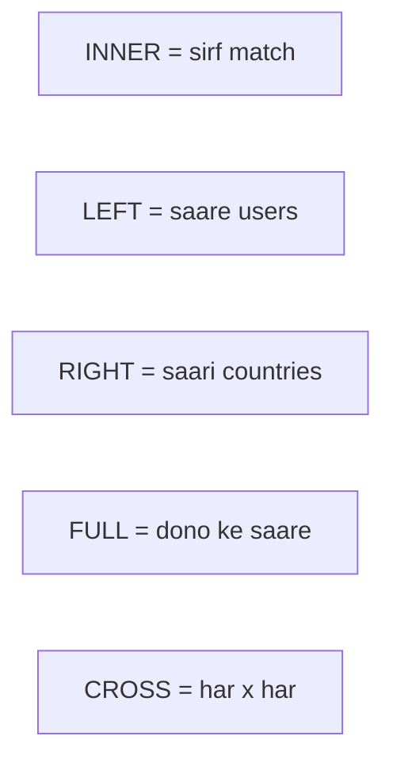

# SQL Server — Interview Q&A

Har sawal: **kya hai** → **kab use** → **example**.  
Tables: `tblusers`, `tblcountry` (class wale). SSMS me chalao.

Poori kahani: [SQL-NOTES.md](SQL-NOTES.md) · Practice: [sql.text](sql.text)

---

## Index

1. [INSERT / UPDATE / DELETE / SELECT](#1-insert--update--delete--select)
2. [3rd highest salary](#2-3rd-highest-salary)
3. [Duplicate records hatana](#3-duplicate-records-hatana)
4. [LIKE](#4-like-operator)
5. [AND, OR, IN, BETWEEN](#5-and-or-in-between)
6. [Stored Procedure — CRUD](#6-stored-procedure--insert-update-delete-select)
7. [SP vs Function](#7-stored-procedure-vs-function)
8. [JOINs](#8-joins--types)
9. [GROUP BY, WHERE vs HAVING](#9-group-by--where-vs-having)
10. [Constraints](#10-constraints)
11. [Composite / Candidate / Alternate](#11-composite-candidate-alternate-key)
12. [Trigger types + Magic tables](#12-trigger-types--magic-table)
13. [View](#13-view)
14. [CASE](#14-case)
15. [WHILE loop](#15-while-loop)
16. [Table se table data transfer](#16-ek-table-se-doosri-me-data)
17. [Transaction + TRY/CATCH](#17-transaction--trycatch)
18. [`#temp` vs `##temp`](#18-temp-vs-temp)

---

## 1. INSERT / UPDATE / DELETE / SELECT

**Kya hai:** table me data **daalna, badalna, hatana, dekhna**.

**Use:** har app ka CRUD yahi hai.

```sql
-- SELECT  (dekhna)
SELECT * FROM tblusers;
SELECT uid, name, salary FROM tblusers WHERE country = 1;

-- INSERT  (nayi row)
INSERT INTO tblusers (name, gender, salary, dob, country)
VALUES ('Rohan', 'male', 22000, '1995-05-12', 1);

-- UPDATE  (badalna)  — WHERE lagana zaroori
UPDATE tblusers SET salary = 25000 WHERE name = 'alok';

-- DELETE  (hatana)  — WHERE lagana zaroori
DELETE FROM tblusers WHERE name = 'test';
```

> Bina `WHERE` ke `UPDATE` / `DELETE` **poori table** badal / hata deta hai.

---

## 2. 3rd highest salary

**Kya hai:** unique salaries me se teesri sabse badi.

**Use:** interview ka common sawal. Duplicate salary ho to `DISTINCT` lagao.

**Aggregate ke saath:** pehle 3 badi unique lao, unme se `MIN` = 3rd.

```sql
SELECT MIN(salary)
FROM (
    SELECT DISTINCT TOP (3) salary
    FROM tblusers
    ORDER BY salary DESC
) AS A;
```

**Bina aggregate:**

```sql
SELECT TOP (1) salary
FROM (
    SELECT DISTINCT TOP (3) salary
    FROM tblusers
    ORDER BY salary DESC
) AS A
ORDER BY salary ASC;
```

| Chahiye | Andar | Bahar |
|---------|--------|--------|
| Nth **highest** | `DISTINCT TOP (N) ORDER BY salary DESC` | `MIN` ya `TOP 1 ASC` |
| Nth **lowest** | `DISTINCT TOP (N) ORDER BY salary ASC` | `MAX` ya `TOP 1 DESC` |

Naam bhi chahiye:

```sql
SELECT name, salary FROM tblusers
WHERE salary = (
    SELECT MIN(salary) FROM (
        SELECT DISTINCT TOP (3) salary FROM tblusers ORDER BY salary DESC
    ) AS A
);
```

---

## 3. Duplicate records hatana

**Kya hai:** same data ki extra copies delete karna. Ek copy rakhni hai.

**Use:** import / galat insert se repeats aa jaate hain.

Yeh **ek hi topic** hai. Interview me 2 common tarike poochte hain:

| Tarika | Idea | Kaunsi row bachti hai |
|--------|------|------------------------|
| `MAX(id) + GROUP BY + NOT IN` | Har group ka sabse bada `id` rakho | Last insert |
| `ROW_NUMBER()` | Har group me number 1, 2, 3… | `ORDER BY` jo choose karo |

Pehle duplicates dekho:

```sql
SELECT name, city, age, COUNT(*) AS Kitne
FROM students
GROUP BY name, city, age
HAVING COUNT(*) > 1;
```

### Class tarika — `MAX(id)` + `NOT IN`

`id` alag hai (PK IDENTITY), lekin `name, city, age` same = duplicate.

`GROUP BY name, city, age` se har group ka **sabse bada id** nikaalo. Jo `id` us list me **nahi**, unhe delete.

```sql
CREATE TABLE students
(
    id   INT PRIMARY KEY IDENTITY,
    name VARCHAR(50),
    city VARCHAR(50),
    age  INT
);

INSERT INTO students VALUES
('Mohan',   'noida',  35),
('Mohan',   'noida',  35),
('Mohan',   'noida',  35),
('Mohnika', 'kanpur', 34),
('Mohnika', 'kanpur', 34),
('Sunita',  'delhi',  30),
('Sunita',  'delhi',  30),
('Sunita',  'delhi',  30),
('alok',    'noida',  37),
('alok',    'noida',  37);

-- rakhna: har group ka MAX(id)   hatana: baaki
DELETE FROM students
WHERE id NOT IN (
    SELECT MAX(id) FROM students GROUP BY name, city, age
);
```

SQL Server kabhi same-table subquery pe error de to andar ek extra table wrap karo:

```sql
DELETE FROM students
WHERE id NOT IN (
    SELECT maxid FROM (
        SELECT MAX(id) AS maxid
        FROM students
        GROUP BY name, city, age
    ) AS t
);
```

Purani row rakhni ho to `MAX` ki jagah `MIN(id)`.

### `ROW_NUMBER` tarika

Pehli row `rn = 1`, baaki delete.

```sql
WITH cte AS (
    SELECT *,
           ROW_NUMBER() OVER (
               PARTITION BY name, city, age
               ORDER BY id
           ) AS rn
    FROM students
)
DELETE FROM cte WHERE rn > 1;
```

`tblusers` par same idea: `PARTITION BY name, gender, salary, dob, country`.

### Nayi table me saaf copy

```sql
SELECT DISTINCT name, city, age
INTO students_clean
FROM students;
```

`IDENTITY` / `id` alag-alag ho to `DISTINCT *` kaam nahi karega — columns specify karo.

---

## 4. LIKE operator

**Kya hai:** text **pattern** se search. Exact `=` nahi.

**Use:** naam se search box, "s se start", email domain.

| Pattern | Matlab |
|---------|--------|
| `'s%'` | s se **start** |
| `'%ta'` | ta pe **end** |
| `'%oh%'` | beech me `oh` |
| `'_lok'` | 1 character + `lok` (alok) |
| `'[am]%'` | a ya m se start |

```sql
SELECT * FROM tblusers WHERE name LIKE 's%';
SELECT * FROM tblusers WHERE name LIKE '%ta';
SELECT * FROM tblusers WHERE name LIKE '%oh%';
SELECT * FROM tblusers WHERE name NOT LIKE 'a%';
```

---

## 5. AND, OR, IN, BETWEEN

**Kya hai:** `WHERE` me conditions jodna.

**Use:** filter — India **aur** salary 15k+, ya list me se, ya range.

```sql
-- AND  = dono true
SELECT * FROM tblusers WHERE gender = 'female' AND salary >= 15000;

-- OR   = koi ek true
SELECT * FROM tblusers WHERE uid = 1 OR uid = 2;

-- IN   = list me se koi (OR ka chhota form)
SELECT * FROM tblusers WHERE uid IN (1, 2, 5);
SELECT * FROM tblusers WHERE country IN (1, 2);

-- BETWEEN = range (donon ends shamil)
SELECT * FROM tblusers WHERE salary BETWEEN 12000 AND 16000;

-- NOT
SELECT * FROM tblusers WHERE country NOT IN (3);
```

`AND` pehle bind hota hai `OR` se. Confusion ho to **brackets** lagao:

```sql
SELECT * FROM tblusers
WHERE country = 1 AND (gender = 'male' OR salary > 18000);
```

---

## 6. Stored Procedure — INSERT, UPDATE, DELETE, SELECT

**Kya hai:** saved SQL recipe. `EXEC` se chalti hai. Parameters = ingredients.

**Use:** app se table directly nahi, SP se CRUD — security + reuse.

```sql
-- SELECT (saare users)
CREATE PROCEDURE sp_GetAllUsers
AS
BEGIN
    SELECT uid, name, gender, salary, dob, country FROM tblusers;
END;

EXEC sp_GetAllUsers;

-- SELECT by id
CREATE PROCEDURE sp_GetUserById @uid INT
AS
BEGIN
    SELECT * FROM tblusers WHERE uid = @uid;
END;

EXEC sp_GetUserById 1;

-- INSERT
CREATE PROCEDURE sp_InsertUser
    @name VARCHAR(50), @gender VARCHAR(50), @salary INT,
    @dob DATE, @country INT
AS
BEGIN
    INSERT INTO tblusers (name, gender, salary, dob, country)
    VALUES (@name, @gender, @salary, @dob, @country);
END;

EXEC sp_InsertUser 'Rohan', 'male', 22000, '1995-05-12', 1;

-- UPDATE
CREATE PROCEDURE sp_UpdateSalary @uid INT, @salary INT
AS
BEGIN
    UPDATE tblusers SET salary = @salary WHERE uid = @uid;
END;

EXEC sp_UpdateSalary 1, 25000;

-- DELETE
CREATE PROCEDURE sp_DeleteUser @uid INT
AS
BEGIN
    DELETE FROM tblusers WHERE uid = @uid;
END;

EXEC sp_DeleteUser 99;
```

### `GO` aur `SET NOCOUNT` — alag se samjho

CRUD examples me yeh do cheezein **zaroori nahi**. Real projects / SSMS scripts me aksar dikhti hain, isliye alag se.

#### `GO` kya hai?

`GO` **SQL language ka keyword nahi** hai. Yeh **SSMS / sqlcmd** ka batch separator hai.

Matlab: yahan tak ka script **alag packet** banao, pehle yeh chalao, phir agla.

**Kyun use:** `CREATE PROCEDURE` ke **turant baad** same batch me `EXEC` / doosri `CREATE` kabhi error deti hai. `GO` se pehle procedure ban jaati hai, phir next batch me `EXEC`.

```sql
CREATE PROCEDURE sp_GetAllUsers
AS
BEGIN
    SELECT uid, name, gender, salary, dob, country FROM tblusers;
END;
GO                  -- yahan pehli batch khatam — SP ab ban chuki

EXEC sp_GetAllUsers;
GO

CREATE PROCEDURE sp_GetUserById @uid INT
AS
BEGIN
    SELECT * FROM tblusers WHERE uid = @uid;
END;
GO

EXEC sp_GetUserById 1;
```

> `GO` ko stored procedure ke **andar** mat likho. Sirf script ke batches todne ke liye.

#### `SET NOCOUNT ON` kya hai?

Har `INSERT` / `UPDATE` / `DELETE` / `SELECT` ke baad SQL Server message bhejta hai: **`(1 row affected)`**.

App (C# / ADO.NET) kabhi is extra message ko **pehla result** samajh leti hai — confusion / extra round-trip.

`SET NOCOUNT ON` = yeh “n rows affected” message **band**. Data wahi aata hai, sirf extra chatter nahi.

**Kyun hamesha SP me lagate hain:** production procedures me almost standard. Performance thodi better, client apps clean.

```sql
CREATE PROCEDURE sp_InsertUser
    @name VARCHAR(50),
    @gender VARCHAR(50),
    @salary INT,
    @dob DATE,
    @country INT
AS
BEGIN
    SET NOCOUNT ON;   -- (1 row affected) mat bhejo

    INSERT INTO tblusers (name, gender, salary, dob, country)
    VALUES (@name, @gender, @salary, @dob, @country);
END;
```

| | Bina `NOCOUNT` | `SET NOCOUNT ON` |
|--|----------------|------------------|
| Messages | `(1 row affected)` dikhega | nahi |
| SELECT data | aata hai | aata hai |
| App / SP best practice | extra noise | **yahi use karo** |

`SET NOCOUNT OFF` default hai — messages wapas on.

---

## 7. Stored Procedure vs Function

**Use:** interview me table yaad rakhna.

| | Stored Procedure | Function |
|--|------------------|----------|
| Call | `EXEC sp_name` | `SELECT dbo.fn_name(...)` |
| Return | Optional; `RETURN` **sirf INT**. Text ke liye `OUTPUT` | Hamesha value (scalar) ya table |
| `SELECT` ke andar? | **Nahi** | **Haan** — `SELECT dbo.fn_GetAge(dob)` |
| INSERT/UPDATE/DELETE | **Haan** | Scalar function me **nahi** (read mostly) |
| Parameters | Input + Output | Input; output alag se nahi |
| Try/catch, transactions | Aasan | Limited |
| Kab | Business logic, CRUD, reports | Calculation: age, grade, tax |

```sql
-- Function: SELECT me use
SELECT name, dbo.fn_GetAge(dob) AS age FROM tblusers;

-- SP: EXEC
EXEC sp_GetAllUsers;

-- SP RETURN VARCHAR = ERROR → OUTPUT use karo
CREATE PROC sp_GetName @uid INT, @m VARCHAR(50) OUT
AS
    SELECT @m = name FROM tblusers WHERE uid = @uid;
```

---

## 8. JOINs & types

**Kya hai:** do tables ko matching column se jodna (`tblusers.country = tblcountry.cid`).

**Use:** user ke saath country **naam** chahiye, sirf number nahi.



```sql
SELECT U.name, C.cname
FROM tblusers U
INNER JOIN tblcountry C ON U.country = C.cid;

SELECT * FROM tblusers LEFT  JOIN tblcountry ON country = cid;
SELECT * FROM tblusers RIGHT JOIN tblcountry ON country = cid;
SELECT * FROM tblusers FULL  JOIN tblcountry ON country = cid;
SELECT * FROM tblusers CROSS JOIN tblcountry;   -- N x M rows
```

| Type | Result |
|------|--------|
| INNER | Sirf jo dono me match |
| LEFT | Left ke saare + match (na mile to NULL) |
| RIGHT | Right ke saare + match |
| FULL | Dono ke saare |
| CROSS | Cartesian product |
| SELF | Same table do alias (`U1` employee, `U2` manager) |

Unmatched:

```sql
SELECT * FROM tblusers LEFT JOIN tblcountry ON country = cid
WHERE tblcountry.cid IS NULL;
```

---

## 9. GROUP BY + WHERE vs HAVING

**GROUP BY:** rows ko teams me baanto, phir `COUNT / SUM / AVG`.

**Use:** har gender me kitne log, har country ki average salary.

```sql
SELECT gender, COUNT(*) AS Kitne
FROM tblusers
GROUP BY gender;
```

| | WHERE | HAVING |
|--|--------|--------|
| Kab | **Group se pehle** rows filter | **Group ke baad** team filter |
| Aggregate? | `COUNT` / `AVG` yahan nahi | `HAVING COUNT(*) > 3` OK |
| Example | `WHERE salary > 12000` | `HAVING AVG(salary) > 14000` |

```sql
SELECT country, AVG(salary) AS AvgSalary
FROM tblusers
WHERE salary > 10000          -- pehle rows
GROUP BY country
HAVING AVG(salary) > 14000;   -- phir teams
```

Order: `FROM → WHERE → GROUP BY → HAVING → SELECT → ORDER BY`

---

## 10. Constraints

**Kya hai:** column par **rule**. Tootega to error, data save nahi.

**Use:** galat / duplicate / khali data rokna.

| Constraint | Rule | Use |
|------------|------|-----|
| `PRIMARY KEY` | Unique + NOT NULL. Ek table = **ek** PK. Clustered index | `uid` |
| `UNIQUE` | Duplicate nahi. **Ek** NULL. Kai unique keys | `aadhar`, `email` |
| `FOREIGN KEY` | Doosri table ke PK ko point. Duplicate OK, kai NULL OK | `country → cid` |
| `NOT NULL` | Khali nahi | `name` |
| `DEFAULT` | Value na do to automatic | `age DEFAULT 18` |
| `CHECK` | Condition true | `salary >= 10000` |

```sql
CREATE TABLE candidates
(
    id      INT PRIMARY KEY IDENTITY,
    name    VARCHAR(50) NOT NULL,
    aadhar  BIGINT UNIQUE NOT NULL,
    salary  INT CHECK (salary >= 10000),
    age     INT DEFAULT 18,
    country INT FOREIGN KEY REFERENCES tblcountry(cid)
);
```

**Clustered index:** insert `3,4,1,2` → store `1,2,3,4`.

---

## 11. Composite, Candidate, Alternate Key

**Composite:** 2+ columns milkar **ek** PK. Alag constraint nahi, concept hai.

```sql
PRIMARY KEY (id, aadhar)   -- Emp6 OK
-- id PRIMARY KEY + aadhar PRIMARY KEY  → Emp5 ERROR (do PK)
```

Interview:

- Ek table me **do PK**? **Nahi.**
- **Do columns** par PK? **Haan** (composite).

**Candidate Key:** jo bhi unique identify kar sake (PK *ban sakta* hai). Kai ho sakti hain: `id`, `email`, `phone`.

**Alternate Key:** candidate me se jo PK **nahi** bani. PK = `id` → alternate = `email`, `phone`.

```text
Kai Candidate Keys → ek select = Primary Key → baaki = Alternate Keys
```

---

## 12. Trigger types + Magic table

**Kya hai:** event par **automatic** code. `EXEC` nahi karte.

**Use:** audit log, salary history, drop table rokna, extra login check.

### DML Trigger (`INSERT` / `UPDATE` / `DELETE` on table)

| Type | Kab |
|------|-----|
| `AFTER` / `FOR` | Action hone ke **baad** (audit) |
| `INSTEAD OF` | Action ki jagah trigger (view update) |

```sql
CREATE TRIGGER trg_AfterInsertUser
ON tblusers
AFTER INSERT
AS
BEGIN
    INSERT INTO tblusers_Audit (UserID, ActionType, ActionDate)
    SELECT uid, 'INSERTED', GETDATE() FROM inserted;
END;
```

### Magic tables

Trigger ke paas 2 memory tables:

| Table | Matlab |
|--------|--------|
| `inserted` | naya data (INSERT / UPDATE ke baad) |
| `deleted` | purana data (DELETE / UPDATE se pehle) |

UPDATE = pehle `deleted` (purani salary), phir `inserted` (nayi).

### DDL Trigger (table / proc create-drop)

Database structure change par.

```sql
CREATE TRIGGER trg_NoDropTable
ON DATABASE
FOR DROP_TABLE
AS
BEGIN
    PRINT 'DROP TABLE allowed nahi.';
    ROLLBACK;
END;
```

### Logon Trigger (server par login)

```sql
CREATE TRIGGER trg_LogonAudit
ON ALL SERVER
FOR LOGON
AS
BEGIN
    -- example: raat ko login block, ya log table me entry
    INSERT INTO master.dbo.LogonLog (LoginName, LogonTime)
    VALUES (ORIGINAL_LOGIN(), GETDATE());
END;
```

> DDL / Logon server-level hain. Practice DB me soch ke chalao; `ROLLBACK` login fail kar sakta hai.

---

## 13. View

**Kya hai:** saved `SELECT`. Virtual table — data copy nahi, query save.

**Use:** salary chhupana, lambi JOIN ko chhota naam.

```sql
CREATE VIEW vw_UserDetails
AS
SELECT U.uid, U.name AS UserName, C.cname AS CountryName
FROM tblusers U
JOIN tblcountry C ON U.country = C.cid;

SELECT * FROM vw_UserDetails WHERE CountryName = 'India';
```

`ALTER VIEW` / `DROP VIEW`. Parameters nahi — filter `WHERE` se.

---

## 14. CASE

**Kya hai:** SQL me if / else.

**Use:** grade banana, gender swap, report columns.

```sql
SELECT name, salary,
    CASE
        WHEN salary < 12000 THEN 'C'
        WHEN salary <= 15000 THEN 'B'
        ELSE 'A'
    END AS grade
FROM tblusers;

UPDATE tblusers
SET gender = CASE
    WHEN gender = 'male' THEN 'female'
    WHEN gender = 'female' THEN 'male'
    ELSE gender
END;
```

Bina `ELSE` ke unmatched values **NULL** ho sakti hain.

---

## 15. WHILE loop

**Kya hai:** jab tak condition true, block repeat.

**Use:** test data 10 rows insert, counter, batch process. Set-based SQL zyada behtar; loop tab jab row-by-row zaroori ho.

```sql
DECLARE @i INT = 1;

WHILE @i <= 5
BEGIN
    PRINT @i;
    SET @i = @i + 1;
END;
```

Table me 3 dummy users:

```sql
DECLARE @n INT = 1;
WHILE @n <= 3
BEGIN
    INSERT INTO tblusers (name, gender, salary, dob, country)
    VALUES ('user' + CAST(@n AS VARCHAR(10)), 'male', 10000, '2000-01-01', 1);
    SET @n = @n + 1;
END;
```

Infinite loop se bachne ke liye counter **hamesha** badhao (`SET @i = @i + 1`).

---

## 16. Ek table se doosri me data

**Kya hai:** copy / move without row-by-row typing.

**Use:** backup, archive, staging se main table.

### Nayi table banao + data (`SELECT INTO`)

```sql
SELECT * INTO tblusers_backup FROM tblusers;
SELECT uid, name, salary INTO tblusers_pay FROM tblusers WHERE salary > 15000;
```

`SELECT INTO` **nayi** table banata hai. Pehle se table ho to error.

### Existing table me daalo (`INSERT INTO … SELECT`)

```sql
CREATE TABLE tblusers_copy
(
    uid INT, name VARCHAR(50), gender VARCHAR(50),
    salary INT, dob DATE, country INT
);

INSERT INTO tblusers_copy (uid, name, gender, salary, dob, country)
SELECT uid, name, gender, salary, dob, country
FROM tblusers
WHERE country = 1;
```

Doosre database se:

```sql
INSERT INTO db5152_6826.dbo.tblusers (name, gender, salary, dob, country)
SELECT name, gender, salary, dob, country
FROM OtherDB.dbo.tblusers;
```

| Method | Table pehle se? | Typical use |
|--------|-----------------|-------------|
| `SELECT * INTO new FROM old` | Nahi — naya banta hai | Quick backup |
| `INSERT INTO existing SELECT …` | Haan | Archive / merge |

---

## 17. Transaction + TRY/CATCH

**Kya hai:** kai statements ko **ek unit**. `COMMIT` = save. `ROLLBACK` = undo.

**Use:** paise transfer — katna + jama **saath**. Adha save nahi.

Bina TRAN: pehli `UPDATE` save, doosri error → **from-account paise kho deta hai**.  
TRY/CATCH print karega Failed, lekin data wapas nahi aata — isliye andar `BEGIN TRANSACTION` + `ROLLBACK`.

```sql
BEGIN TRY
    BEGIN TRANSACTION;
    UPDATE tblbank SET amount = amount - @amt WHERE accno = @fromacc;
    UPDATE tblbank SET amount = amount + @amt WHERE accno = @toacc;
    COMMIT TRANSACTION;
END TRY
BEGIN CATCH
    ROLLBACK TRANSACTION;
    PRINT 'Transaction Failed !!';
END CATCH
```

---

## 18. `#temp` vs `##temp`

**Kya hai:** tempdb me temporary table. `#` = is session. `##` = saari sessions.

**Use:** beech ka result; permanent table nahi banana.

| | `#table` | `##table` |
|--|----------|-----------|
| Scope | Current session | All sessions |
| Drop | Session / SP end | Creator session end + koi use nahi |
| Doosri window | Nahi dikhe | Dikhe |
| Same naam 2 sessions | OK (unique suffix) | Error |
| Security | Private | Doosra user dekh sakta hai |

**Fayde:** intermediate data, index, JOIN, auto-clean (`#`).  
**Nuksaan:** tempdb load; `##` leak + naam clash. Zyada tar **`#` use karo**.

```sql
SELECT uid, name, salary INTO #highpay FROM tblusers WHERE salary > 15000;
SELECT * FROM #highpay;
DROP TABLE #highpay;
```

---

## 30-second cheat
CRUD          → INSERT UPDATE DELETE SELECT
3rd salary    → DISTINCT TOP 3 DESC, phir MIN
Duplicates    → MAX(id)+GROUP BY+NOT IN  ya  ROW_NUMBER rn>1
LIKE          → % start/end/beech, _ ek char
SP vs FN      → EXEC vs SELECT dbo.fn; SP CRUD, FN calculate
JOIN          → INNER match, LEFT saari left, FULL dono
WHERE vs HAVING → pehle rows, baad me groups
PK vs Unique  → PK NULL nahi + ek; Unique ek NULL + kai
Composite     → PRIMARY KEY (col1, col2)
Trigger       → DML table, DDL database, Logon server
Magic         → inserted / deleted
View          → saved SELECT
CASE          → if-else + ELSE
WHILE         → counter + BEGIN END
Copy          → SELECT INTO (naya) / INSERT SELECT (purana)
Transaction   → BEGIN TRAN … COMMIT ya ROLLBACK; TRY/CATCH
Temp          → # session, ## global; @table chhoti list
```
