# SQL Server Notes (shuru se aakhir tak)

> Socho database ek **filing cabinet** hai.  
> Uske andar **registers** (tables) hain.  
> Har row ek **record** hai.  
> Record par naam, salary, date jaise **columns** hote hain.

Yeh notes **SQL Server** ke liye hain (SSMS me chalao).  
Har chapter me: pehle picture → phir seedhi baat → phir SQL.

---

## Index

1. [Database aur Table](#1-database-aur-table--filing-cabinet)
2. [Column ka naam badalna](#2-column-ka-naam-badalna--sp_rename)
3. [JOIN — do tables ko milana](#3-join--do-registers-ko-milana)
4. [JOIN ke 5 types](#4-join-ke-5-types)
5. [SELF JOIN](#5-self-join--employee-aur-manager)
6. [CASE — if / else](#6-case--if--else-wali-magic)
7. [Text jodna](#7-text-jodna--concatenation)
8. [Date aur Time](#8-date-aur-time)
9. [SQL Server ki hidden list](#9-sql-server-ki-hidden-list--sysobjects)
10. [Functions](#10-functions--chhota-machine)
11. [View](#11-view--khidki)
12. [Stored Procedure](#12-stored-procedure--recipe)
13. [Trigger](#13-trigger--automatic-doorbell)
14. [Teenon me fark](#14-view-vs-stored-procedure-vs-trigger)
15. [Filter aur sort](#15-filter-aur-sort--where-order-by-top)
16. [GROUP BY](#16-group-by--teams-banao-phir-gino)
17. [Subquery](#17-subquery--sawal-ke-andar-sawal)
18. [Constraints](#18-constraints--rules-on-columns)
    - [6 constraints](#6-constraints-ki-list)
    - [Primary / Unique / Foreign](#1-primary-key)
    - [Composite / Candidate / Alternate](#composite-key)
    - [Sab constraints ek table me](#sab-6-constraints-ek-table-me--candidates)
19. [SP RETURN vs OUTPUT](#19-sp-return-vs-output)

---

## 1. Database aur Table — filing cabinet

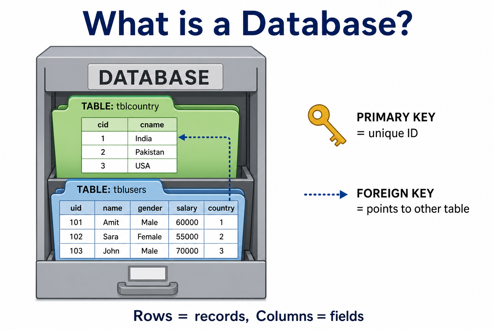

### Seedhi baat

| Cheez | Office me | SQL me |
|--------|-----------|--------|
| Filing cabinet | Poora project ka data | `DATABASE` |
| Register | Users ki list, countries ki list | `TABLE` |
| Unique ID | Kisi ka bhi duplicate nahi | `PRIMARY KEY` |
| Reference number | Doosri list ki taraf ishara | `FOREIGN KEY` |
| Nayi row likhna | Naya record add | `INSERT` |
| Register banana | Table banana | `CREATE TABLE` |

### Picture me relation

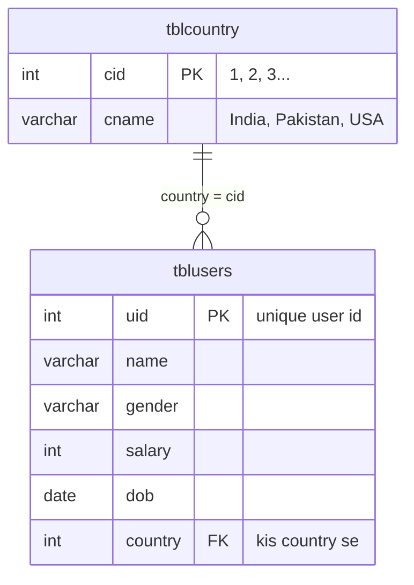

Padho aise: **ek country ke kai users** ho sakte hain.  
`tblusers.country` number `tblcountry.cid` se match karta hai.

### Step 1 — database banao

```sql
CREATE DATABASE db5152_6826;
USE db5152_6826;
```

`USE` ka matlab: ab isi database ke andar kaam karo.

### Step 2 — countries wali table

```sql
CREATE TABLE tblcountry
(
    cid   INT PRIMARY KEY IDENTITY, -- 1, 2, 3 automatic
    cname VARCHAR(50)               -- India, Pakistan...
);
```

**`IDENTITY`** = unique ID khud ban jaati hai. Tumhe number nahi dena.

```sql
INSERT INTO tblcountry VALUES ('India'), ('Pakistan'), ('usa');
```

Ab table aisi dikhegi:

| cid | cname |
|-----|--------|
| 1 | India |
| 2 | Pakistan |
| 3 | usa |

### Step 3 — users wali table

```sql
CREATE TABLE tblusers
(
    uid     INT PRIMARY KEY IDENTITY,
    name    VARCHAR(50),
    gender  VARCHAR(50),
    salary  INT,
    dob     DATE,          -- YYYY-MM-DD
    country INT FOREIGN KEY REFERENCES tblcountry(cid)
            -- sirf wahi number jo tblcountry.cid me maujood ho
);
```

```sql
INSERT INTO tblusers VALUES ('alok',   'male',        13000, '1984-10-04', 1);
INSERT INTO tblusers VALUES ('monika', 'female',      15000, '1990-10-04', 2);
INSERT INTO tblusers VALUES ('javed',  'male',        11000, '1981-10-04', 3);
INSERT INTO tblusers VALUES ('harish', 'transgender', 18000, '1983-10-04', 3);
INSERT INTO tblusers VALUES ('seema',  'female',      17000, '1982-10-04', 2);
INSERT INTO tblusers VALUES ('tarun',  'transgender', 16000, '1993-10-04', 1);
INSERT INTO tblusers VALUES ('mohan',  'transgender', 10000, '1997-10-04', 1);
INSERT INTO tblusers VALUES ('iqbal',  'male',        14000, '1999-10-04', 2);
INSERT INTO tblusers VALUES ('sohan',  'male',        15000, '1990-10-04', 2);
INSERT INTO tblusers VALUES ('sunita',   'female', 19000, '1991-10-04', 1);
INSERT INTO tblusers VALUES ('sumintra', 'female', 12000, '1991-10-04', NULL);
INSERT INTO tblusers VALUES ('madhu',    'female', 19000, '1991-10-04', NULL);
```

**Yaad rakho:** last number `country` hai, naam nahi. `1` matlab India.

> FK hone par `country = 4` **error** dega jab tak Brazil table me na ho.  
> `UPDATE tblusers SET country = 50 WHERE uid = 3` bhi error — `tblcountry` me 50 nahi hai.

> Tip: data dekhne ke liye hamesha  
> `SELECT * FROM tblusers;`  
> `SELECT * FROM tblcountry;`

---

## 2. Column ka naam badalna — `sp_rename`

Kabhi column ka heading galat likh diya? Mitao mat — **rename** karo.

```sql
-- Syntax: purana naam, naya naam
sp_rename 'tblusers.country', 'cid';
sp_rename 'tblcountry.cname', 'name';
```

Wapas pehle jaisa:

```sql
sp_rename 'tblusers.cid', 'country';
sp_rename 'tblcountry.name', 'cname';
```

> **Bahut zaroori:** is notes ke baaki JOINs me column ka naam **`country`** hi hai.  
> Rename karke chhodoge to `ON country = cid` error dega. Practice ke baad **wapas rename** kar lena.

---

## 3. JOIN — do registers ko milana

Alok ka `country = 1` hai. `1` ka matlab kya? `tblcountry` me jaao — **India**.

JOIN = do tables ko **matching number** se chipka dena.

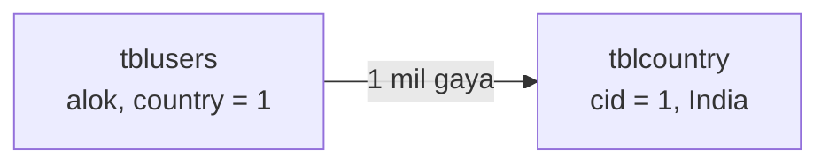

### Simple JOIN

```sql
SELECT *
FROM tblusers
JOIN tblcountry ON tblusers.country = tblcountry.cid;
```

### Column confusion (ambiguity)

Agar dono tables me same naam ho (`name`, `cid`), SQL poochta hai: **kaunsa `name`?**

Galat:

```sql
-- ERROR: name dono jagah hai
SELECT uid, name, cname FROM tblusers JOIN tblcountry ON cid = country;
```

Sahi — chhota nickname (alias) do:

```sql
SELECT
    U.uid,
    U.name   AS UserName,
    U.gender,
    U.salary,
    U.dob,
    C.cname  AS CountryName
FROM tblusers   AS U
JOIN tblcountry AS C ON U.country = C.cid;
```

`U` = users, `C` = country. Ab SQL confuse nahi hota.

Dono columns ka naam `name` ho to GridView / result me **do `name`** dikhte hain — confuse. Alias do:

```sql
SELECT U.uid, U.name AS name1, U.gender, U.salary, U.dob, C.name AS name2
FROM tblusers AS U
JOIN tblcountry AS C ON U.cid = C.cid;
```

---

## 4. JOIN ke 5 types

Pehle ek extra country daal dete hain jiska **koi user nahi**:

```sql
INSERT INTO tblcountry (cname) VALUES ('Brazil');  -- cid = 4
```

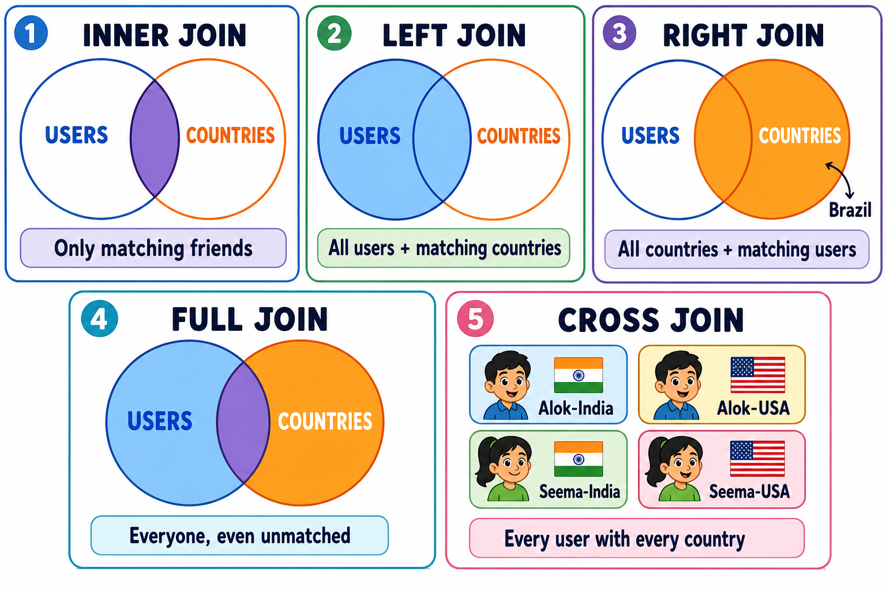

| Type | Seedhi baat | Example |
|------|-------------|---------|
| **INNER** | Sirf jo **dono** me match hon | Users jinki country list me hai |
| **LEFT** | Left table ke **saare** + match | Saare users (country na mile to khali) |
| **RIGHT** | Right table ke **saare** + match | **Brazil bhi** aayega, user columns khali |
| **FULL** | Dono ke saare | Koi bhi na chhoote |
| **CROSS** | Har user × har country | 10 users × 4 countries = **40 rows** |

```sql
-- 1. INNER — sirf matching
SELECT * FROM tblusers INNER JOIN tblcountry ON country = cid;

-- 2. LEFT — saare users
SELECT * FROM tblusers LEFT JOIN tblcountry ON country = cid;

-- 3. RIGHT — saari countries (Brazil bhi)
SELECT * FROM tblusers RIGHT JOIN tblcountry ON country = cid;

-- 4. FULL — dono taraf sab
SELECT * FROM tblusers FULL JOIN tblcountry ON country = cid;

-- 5. CROSS — har combination
SELECT * FROM tblusers CROSS JOIN tblcountry;
```

### Jo match nahi hue, unhe dhoondhna

```sql
-- Users jinki country list me nahi mili
SELECT *
FROM tblusers LEFT JOIN tblcountry ON country = cid
WHERE tblcountry.cid IS NULL;

-- Jo kisi ek table me missing hain
SELECT *
FROM tblusers FULL JOIN tblcountry ON country = cid
WHERE tblcountry.cid IS NULL OR tblusers.uid IS NULL;
```

`IS NULL` = woh box khali hai, match nahi hua.

### Do alag databases ko join

```sql
SELECT U.uid, U.name, C.cname
FROM DB1.dbo.tblusers   AS U
JOIN DB2.dbo.tblcountry AS C ON U.country = C.cid;
```

Pattern: `Database.Schema.Table` — jaise ghar.gali.makaan.

---

## 5. SELF JOIN — employee aur manager

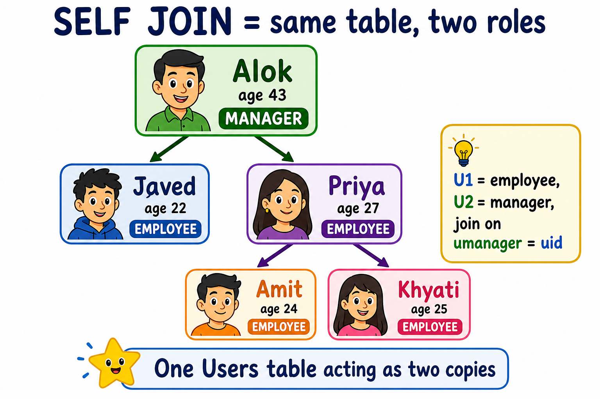

Ek hi table ko **do baar** padho: ek baar employee, ek baar manager.

```sql
CREATE TABLE Users
(
    uid      INT PRIMARY KEY IDENTITY,
    uname    VARCHAR(50),
    uage     INT,
    umanager INT   -- isi table ka uid
);

INSERT INTO Users (uname, uage, umanager) VALUES
('alok',   43, 3),
('amit',   24, 4),
('khyati', 25, 5),
('javed',  22, 1),
('priya',  27, 1);
```

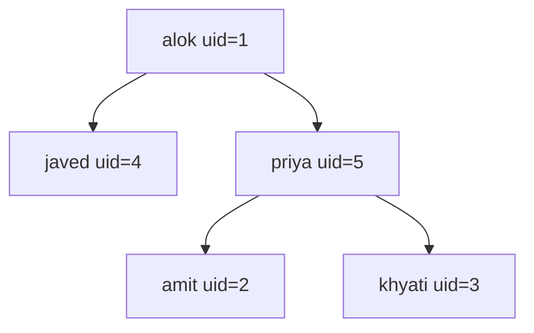

```sql
-- U1 = employee, U2 = uska manager
SELECT
    U1.uid   AS EmpID,
    U1.uname AS EmployeeName,
    U1.uage  AS EmployeeAge,
    U2.uname AS ManagerName
FROM Users AS U1
JOIN Users AS U2 ON U2.uid = U1.umanager;
```

**Trick:** same table, do nicknames. `U1.umanager = U2.uid`.

INNER JOIN me woh employee nahi aata jiska manager match na ho. Sab dikhane ke liye:

```sql
SELECT U1.uid, U1.uname, U1.uage, U2.uname AS ManagerName
FROM Users AS U1
FULL JOIN Users AS U2 ON U2.uid = U1.umanager;
```

---

## 6. CASE — if / else wali magic

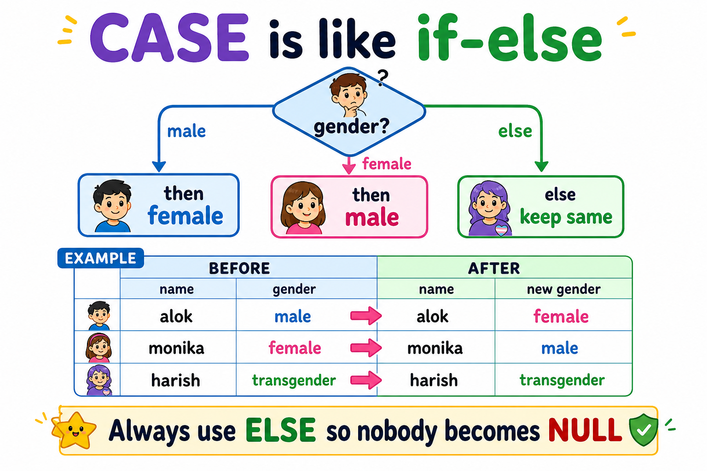

`CASE` = “agar yeh to woh, nahi to kuch aur”.

### Galat swap (transgender `NULL` ho jaayega)

```sql
UPDATE tblusers
SET gender = CASE
    WHEN gender = 'male'   THEN 'female'
    WHEN gender = 'female' THEN 'male'
END;
-- ELSE nahi hai → baaki values NULL
```

### Sahi swap — `ELSE` se baaki log safe

```sql
UPDATE tblusers
SET gender = CASE
    WHEN gender = 'male'   THEN 'female'
    WHEN gender = 'female' THEN 'male'
    ELSE gender
END;
```

### Teen values ghumana (rotate)

```sql
UPDATE tblusers
SET gender = CASE
    WHEN gender = 'male'        THEN 'female'
    WHEN gender = 'female'      THEN 'transgender'
    WHEN gender = 'transgender' THEN 'male'
END;
```

### Country IDs swap

```sql
UPDATE tblusers
SET country = CASE
    WHEN country = 1 THEN 2
    WHEN country = 2 THEN 1
    ELSE country
END;
```

> **Yaad rakho:** `ELSE` likhna = koi value `NULL` nahi hoti.

### Do columns ko aapas me swap

Same type ki columns ek hi `UPDATE` me swap ho sakti hain:

```sql
UPDATE tblusers SET name = gender, gender = name;
UPDATE tblusers SET name = gender, gender = name WHERE uid < 6;
```

Alag type swap nahi hota:

```sql
-- ERROR: name VARCHAR, salary INT
UPDATE tblusers SET name = salary, salary = name;
```

---

## 7. Text jodna — concatenation

Do shabd jodna jaise: `alok` + `male` = `alok male`.

```sql
SELECT name + ' ' + gender AS UserDetails FROM tblusers;
SELECT name + SPACE(10) + gender AS UserDetails FROM tblusers;  -- 10 spaces
```

Number ko seedha text se **nahi** jod sakte:

```sql
-- ERROR
SELECT name + salary FROM tblusers;
```

Pehle number ko text banao:

```sql
SELECT name + SPACE(5) + gender + SPACE(5) + CONVERT(VARCHAR(50), salary)
FROM tblusers;

SELECT name + SPACE(5) + gender + SPACE(5) + CAST(salary AS VARCHAR(50))
FROM tblusers;
```

`CAST` aur `CONVERT` dono kaam same: **type badalna**.

Column ke aage text chipkana:

```sql
SELECT ('User ' + CONVERT(VARCHAR(10), uid)) AS uid, name, gender, salary
FROM tblusers;
```

Puri column ka type hi badalna ho (soch ke):

```sql
ALTER TABLE tblusers ALTER COLUMN salary VARCHAR(50);
```

---

## 8. Date aur Time

```sql
SELECT GETDATE();   -- aaj ki date + time
```

### Date ko sundar format

```sql
SELECT CONVERT(VARCHAR(20), GETDATE(), 101); -- 08/14/2026   MM/DD/YYYY
SELECT CONVERT(VARCHAR(20), GETDATE(), 103); -- 14/08/2026   DD/MM/YYYY
SELECT CONVERT(VARCHAR(20), GETDATE(), 106); -- 14 Aug 2026
SELECT CONVERT(VARCHAR(20), GETDATE(), 108); -- sirf time
```

### Din ka naam

```sql
SELECT DATENAME(DW, GETDATE());      -- aaj ka din, jaise Friday
SELECT DATENAME(DW, '1947-08-15');   -- Friday
```

`DW` = Day of Week.

### Do dates ke beech kitna fark

```sql
SELECT DATEDIFF(YEAR, '1984-10-04', GETDATE()); -- kitne saal
SELECT DATEDIFF(DAY,  '1984-10-04', GETDATE()); -- kitne din
SELECT DATEDIFF(HOUR, '1984-10-04', GETDATE()); -- kitne ghante
```

---

## 9. SQL Server ki hidden list — `sys.objects`

SQL Server ke paas ek **secret register** hai: is database me kya-kya bana.

```sql
SELECT * FROM sys.objects WHERE type = 'U';   -- User tables
SELECT * FROM sys.objects WHERE type = 'P';   -- Stored procedures
SELECT * FROM sys.objects WHERE type = 'FN';  -- Scalar functions
```

| Code | Matlab |
|------|--------|
| `U` | Table |
| `P` | Procedure |
| `FN` | Function |

---

## 10. Functions — chhota machine

Function = box jisme kuch **daalo**, ek **jawab** nikle.

SQL Server me call karte waqt `dbo.` lagana zaroori hai: `dbo.fn_GetAge(dob)`.

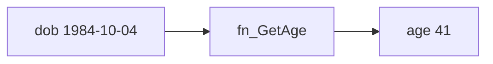

### Function 1 — umar

```sql
CREATE FUNCTION fn_GetAge (@dob DATE)
RETURNS INT
AS
BEGIN
    RETURN DATEDIFF(YEAR, @dob, GETDATE());
END;
```

### Function 2 — salary se grade

```sql
CREATE FUNCTION fn_GetGrade (@salary INT)
RETURNS VARCHAR(50)
AS
BEGIN
    DECLARE @grade VARCHAR(50);

    IF (@salary < 12000)
        SET @grade = 'C Grade';
    ELSE IF (@salary >= 12000 AND @salary <= 15000)
        SET @grade = 'B Grade';
    ELSE
        SET @grade = 'A Grade';

    RETURN @grade;
END;
```

### Function 3 — mahine ki salary × 12

```sql
CREATE FUNCTION fn_AnnualSalary (@salary INT)
RETURNS INT
AS
BEGIN
    RETURN @salary * 12;
END;
```

### Sab ek saath

```sql
SELECT
    uid,
    name,
    gender,
    salary,
    dbo.fn_GetGrade(salary)      AS grade,
    dbo.fn_AnnualSalary(salary)  AS annualsalary,
    dob,
    dbo.fn_GetAge(dob)           AS age
FROM tblusers;
```

> Purane notes me `fn3(gender)` tha jo `INT` maangta tha, lekin table me gender **text** hai (`male`).  
> Isliye yahan woh function hata diya — warna error aati.

---

## 11. View — khidki

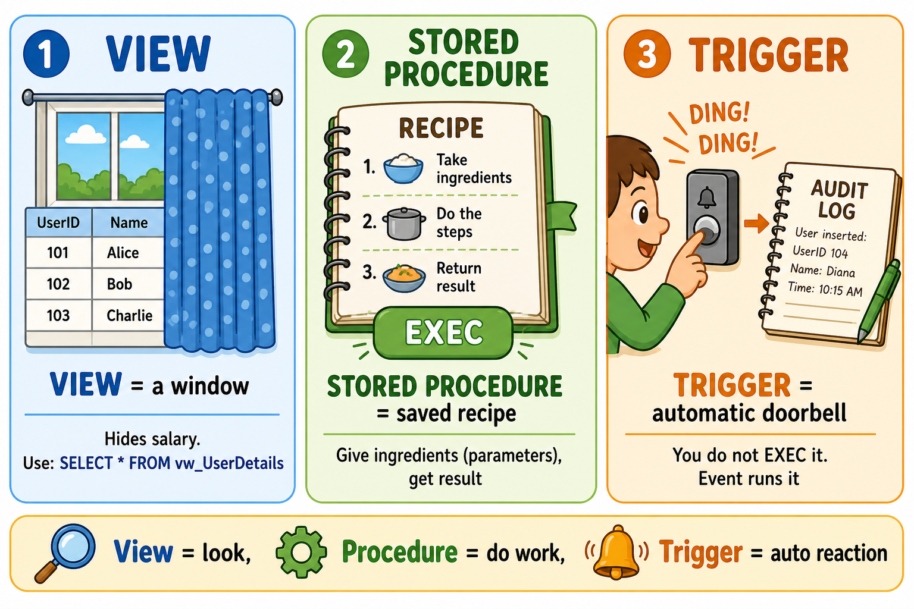

**View** = khidki. Table ka data copy nahi hota. Sirf ek saved `SELECT`.

Kyun? Salary chhupani ho, ya lambi JOIN ko chhota naam dena ho.

```sql
CREATE VIEW vw_UserDetails
AS
SELECT
    U.uid,
    U.name  AS UserName,
    U.gender,
    U.dob,
    C.cname AS CountryName
FROM tblusers   AS U
JOIN tblcountry AS C ON U.country = C.cid;
```

```sql
SELECT * FROM vw_UserDetails;
SELECT * FROM vw_UserDetails WHERE CountryName = 'India';
```

Badalna / mitaana:

```sql
ALTER VIEW vw_UserDetails
AS
SELECT U.uid, U.name AS UserName, C.cname AS CountryName
FROM tblusers AS U
JOIN tblcountry AS C ON U.country = C.cid;

DROP VIEW vw_UserDetails;
```

---

## 12. Stored Procedure — recipe

Procedure = **recipe**. Ek baar likho, `EXEC` se baar-baar chalao.  
Parameters = ingredients.

### Bina masale wali recipe

```sql
CREATE PROCEDURE sp_GetAllUsers
AS
BEGIN
    SET NOCOUNT ON;   -- extra "n rows" message band
    SELECT uid, name, gender, salary, dob, country FROM tblusers;
END;

EXEC sp_GetAllUsers;
```

### Input parameters — naya user daalna

```sql
CREATE PROCEDURE sp_InsertUser
    @name    VARCHAR(50),
    @gender  VARCHAR(50),
    @salary  INT,
    @dob     DATE,
    @country INT
AS
BEGIN
    SET NOCOUNT ON;

    INSERT INTO tblusers (name, gender, salary, dob, country)
    VALUES (@name, @gender, @salary, @dob, @country);

    SELECT SCOPE_IDENTITY() AS NewUserID;  -- naya uid
END;

EXEC sp_InsertUser
    @name = 'Rohan',
    @gender = 'male',
    @salary = 22000,
    @dob = '1995-05-12',
    @country = 1;
```

### OUTPUT — jawab bahar laana

```sql
CREATE PROCEDURE sp_GetUserStats
    @TotalUsers INT OUTPUT,
    @AvgSalary  INT OUTPUT
AS
BEGIN
    SET NOCOUNT ON;
    SELECT
        @TotalUsers = COUNT(*),
        @AvgSalary  = AVG(salary)
    FROM tblusers;
END;

DECLARE @UserCount INT, @AverageSal INT;

EXEC sp_GetUserStats
    @TotalUsers = @UserCount OUTPUT,
    @AvgSalary  = @AverageSal OUTPUT;

SELECT @UserCount AS TotalUsers, @AverageSal AS AverageSalary;
```

---

## 13. Trigger — automatic doorbell

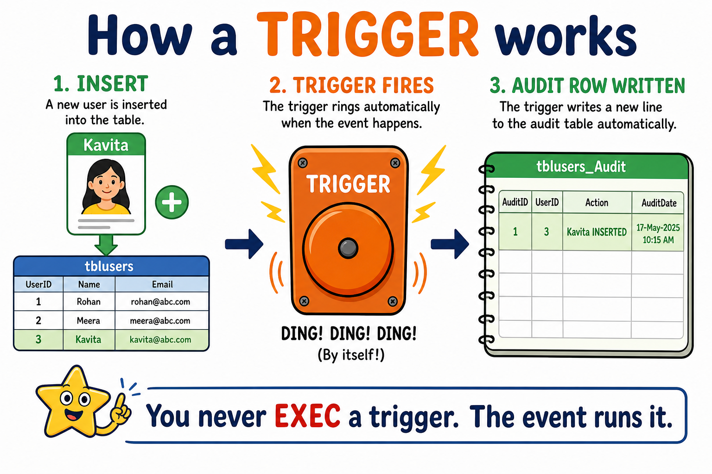

Trigger **khud** chalta hai. `EXEC` nahi karte.  
Jab `INSERT` / `UPDATE` / `DELETE` hota hai, bell bajti hai.

Do magic tables:

| Table | Matlab |
|--------|--------|
| `inserted` | naya data |
| `deleted` | purana data |

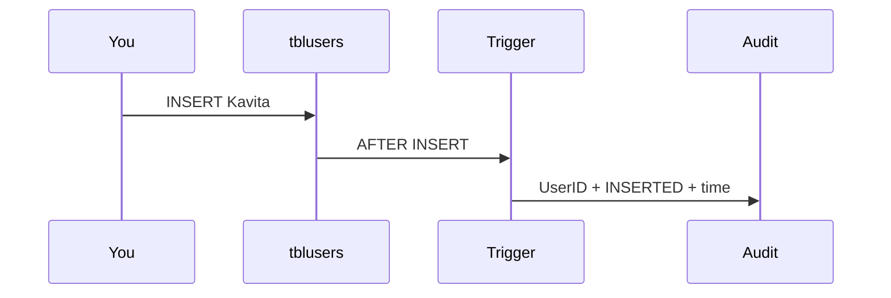

### AFTER INSERT — audit log

```sql
CREATE TABLE tblusers_Audit
(
    AuditID    INT PRIMARY KEY IDENTITY,
    UserID     INT,
    ActionType VARCHAR(50),
    ActionDate DATETIME
);

CREATE TRIGGER trg_AfterInsertUser
ON tblusers
AFTER INSERT
AS
BEGIN
    SET NOCOUNT ON;
    INSERT INTO tblusers_Audit (UserID, ActionType, ActionDate)
    SELECT uid, 'INSERTED', GETDATE()
    FROM inserted;
END;
```

Test:

```sql
INSERT INTO tblusers VALUES ('Kavita', 'female', 21000, '1992-08-11', 1);
SELECT * FROM tblusers;
SELECT * FROM tblusers_Audit;
```

### AFTER UPDATE — purani vs nayi salary

```sql
CREATE TABLE tblSalaryHistory
(
    LogID        INT PRIMARY KEY IDENTITY,
    UserID       INT,
    OldSalary    INT,
    NewSalary    INT,
    ModifiedDate DATETIME
);

CREATE TRIGGER trg_TrackSalaryChange
ON tblusers
AFTER UPDATE
AS
BEGIN
    SET NOCOUNT ON;

    IF UPDATE(salary)
    BEGIN
        INSERT INTO tblSalaryHistory (UserID, OldSalary, NewSalary, ModifiedDate)
        SELECT i.uid, d.salary, i.salary, GETDATE()
        FROM inserted i
        JOIN deleted  d ON i.uid = d.uid;
    END
END;

UPDATE tblusers SET salary = 25000 WHERE name = 'alok';
SELECT * FROM tblSalaryHistory;
```

`inserted` = nayi salary, `deleted` = purani salary. Dono ko join karke history ban gayi.

---

## 14. View vs Stored Procedure vs Trigger

| Sawal | View | Stored Procedure | Trigger |
|--------|------|------------------|---------|
| Kyun? | Data dikhana / chhupana | Kaam karna (CRUD) | Event par automatic kaam |
| Parameters? | Nahi (sirf `WHERE`) | Haan (input + output) | Nahi |
| Kaise chale? | `SELECT * FROM view` | `EXEC procedure` | Khud — INSERT/UPDATE/DELETE |
| Data badal sakte? | Simple views me thoda | Poora | Poora, automatic |

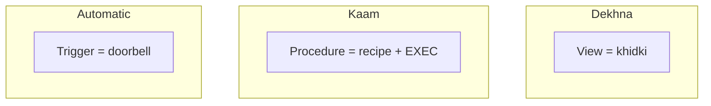

---

## 15. Filter aur sort — WHERE, ORDER BY, TOP

Pehle poori table mat padho. **Filter** = sirf woh rows jo chahiye. **Sort** = rows ko line me lagaao.


### WHERE — sirf matching rows

```sql
SELECT * FROM tblusers WHERE country = 1;           -- India
SELECT * FROM tblusers WHERE salary > 15000;
SELECT * FROM tblusers WHERE gender = 'female' AND salary >= 15000;
SELECT * FROM tblusers WHERE name LIKE 's%';        -- s se start
SELECT * FROM tblusers WHERE country IN (1, 2);     -- India ya Pakistan
```

| Operator | Matlab |
|----------|--------|
| `=` `>` `<` `>=` `<=` `<>` | barabar / bada / chhota |
| `AND` / `OR` | dono / koi ek |
| `LIKE 's%'` | s se shuru |
| `IN (1, 2)` | list me se koi |
| `BETWEEN 12000 AND 16000` | range |

### ORDER BY — line me lagaao

```sql
SELECT * FROM tblusers ORDER BY salary;           -- chhoti se badi
SELECT * FROM tblusers ORDER BY salary DESC;      -- badi se chhoti
SELECT * FROM tblusers ORDER BY country, salary DESC;
```

`ASC` = chhota pehle (default), `DESC` = bada pehle.

### DISTINCT aur TOP

```sql
SELECT DISTINCT gender FROM tblusers;     -- unique values, repeat nahi
SELECT TOP 3 * FROM tblusers ORDER BY salary DESC;  -- top 3 salary
```

---

## 16. GROUP BY — teams banao, phir gino

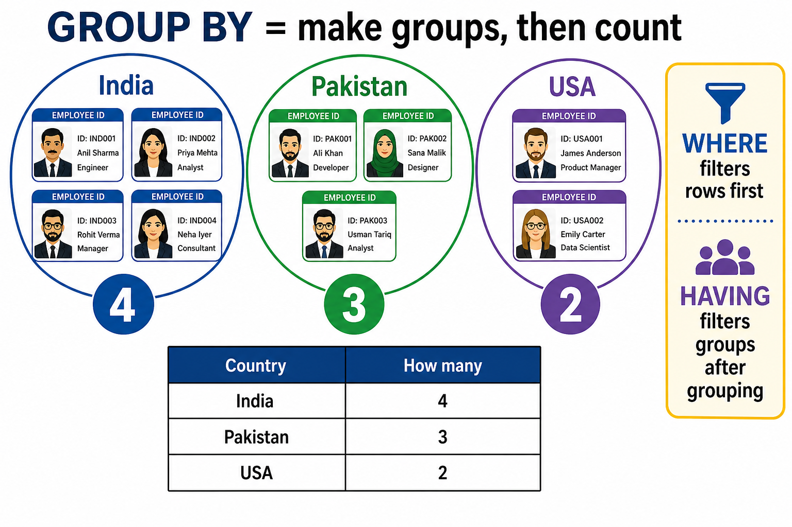

Socho users ko **country ke groups** me baanto, phir pucho: har group me kitne log? Average salary kya hai?

Yahi `GROUP BY` hai.

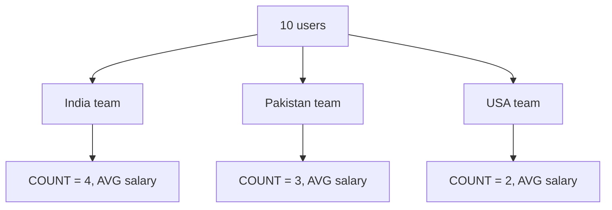

### 5 machine words (aggregates)

| Function | Kya karta hai |
|----------|----------------|
| `COUNT(*)` | kitni rows |
| `SUM(salary)` | total |
| `AVG(salary)` | average |
| `MIN(salary)` | sabse chhoti |
| `MAX(salary)` | sabse badi |

```sql
SELECT COUNT(*) AS TotalUsers FROM tblusers;
SELECT SUM(salary) AS TotalPay, AVG(salary) AS AvgPay FROM tblusers;
SELECT MIN(salary) AS Lowest, MAX(salary) AS Highest FROM tblusers;
```

### GROUP BY — har team ka jawab

```sql
SELECT gender, COUNT(*) AS Kitne
FROM tblusers
GROUP BY gender;

SELECT country, COUNT(*) AS Kitne, AVG(salary) AS AvgSalary
FROM tblusers
GROUP BY country;
```

Country naam ke saath:

```sql
SELECT C.cname, COUNT(*) AS Kitne, AVG(U.salary) AS AvgSalary
FROM tblusers U
JOIN tblcountry C ON U.country = C.cid
GROUP BY C.cname;
```

### HAVING — team ke baad filter

`WHERE` rows ko **group se pehle** hataata hai.  
`HAVING` teams ko **group ke baad** hataata hai.

```sql
-- sirf woh gender jahan 3 se zyada log hain
SELECT gender, COUNT(*) AS Kitne
FROM tblusers
GROUP BY gender
HAVING COUNT(*) > 3;

-- average salary 14000 se upar wali countries
SELECT country, AVG(salary) AS AvgSalary
FROM tblusers
GROUP BY country
HAVING AVG(salary) > 14000;
```


> **Yaad rakho:** `SELECT` me jo column hai, ya to `GROUP BY` me hona chahiye, ya phir `COUNT/SUM/AVG` ke andar.

Galat:

```sql
-- ERROR: name GROUP BY me nahi hai
SELECT name, COUNT(*) FROM tblusers GROUP BY gender;
```

---

## 17. Subquery — sawal ke andar sawal

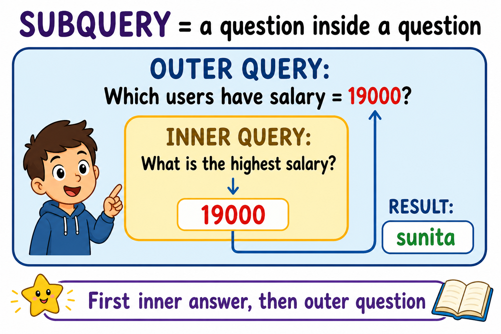

Pehle andar wala sawal, uska jawab bahar wale sawal me.

### Kaunsi sabse zyada salary?

```sql
SELECT MAX(salary) FROM tblusers;              -- andar: 19000
SELECT * FROM tblusers
WHERE salary = (SELECT MAX(salary) FROM tblusers);  -- sunita
```

### Average se zyada kamane wale

```sql
SELECT name, salary
FROM tblusers
WHERE salary > (SELECT AVG(salary) FROM tblusers);
```

### IN — list ke andar

```sql
-- un users ko lao jinki country India ya Pakistan hai
SELECT name, country
FROM tblusers
WHERE country IN (SELECT cid FROM tblcountry WHERE cname IN ('India', 'Pakistan'));
```

### Correlated — har row ke liye andar wala sawal

```sql
-- har user: kya uski salary apni country ki average se zyada hai?
SELECT U.name, U.salary, U.country
FROM tblusers U
WHERE U.salary > (
    SELECT AVG(salary)
    FROM tblusers X
    WHERE X.country = U.country
);
```

Yahan andar wala query **bahar wale `U.country`** ko dekhta hai. Isliye har user ke liye alag average.

---

## 18. Constraints — rules on columns

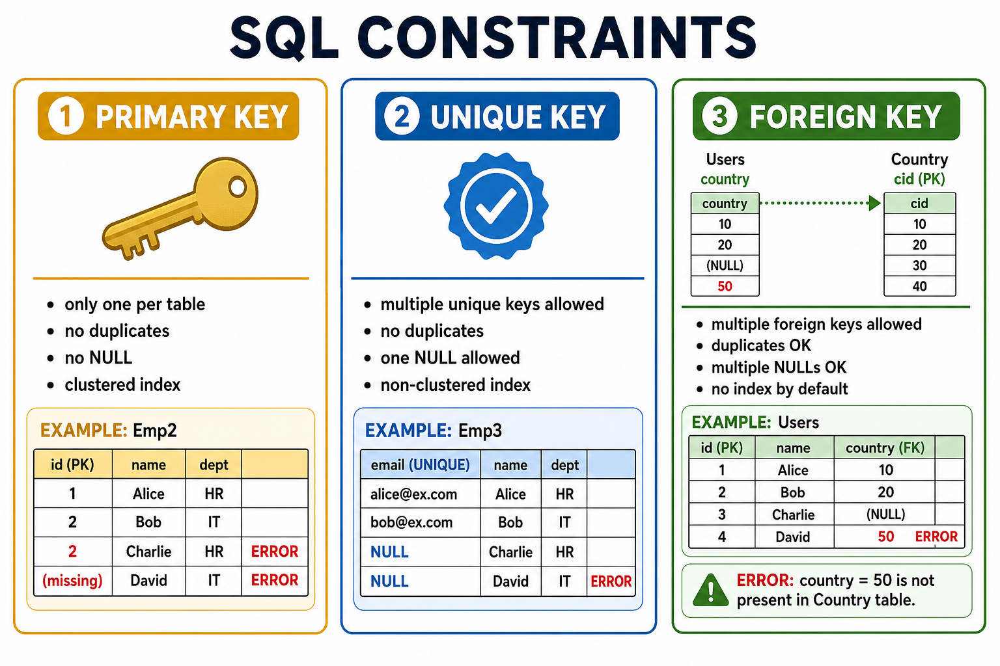

Constraint = column par **rule**. Rule tootega to SQL **error** dega, data save nahi hoga.

### 6 constraints ki list

| # | Constraint | Seedhi baat |
|---|------------|-------------|
| 1 | `PRIMARY KEY` | Row ka unique ID. Duplicate nahi, NULL nahi. |
| 2 | `UNIQUE` | Duplicate nahi. **Ek** NULL chalega. |
| 3 | `FOREIGN KEY` | Doosri table ke PK ko point. |
| 4 | `NOT NULL` | Column khali nahi chhod sakte. |
| 5 | `DEFAULT` | Value na do to automatic value. |
| 6 | `CHECK` | Condition true honi chahiye. |

---

### 1) PRIMARY KEY

| Rule | Matlab |
|------|--------|
| Ek table me **ek** hi PK | Do alag `PRIMARY KEY` likhoge to error |
| Duplicate nahi | Wahi `id` do baar nahi |
| NULL nahi | `id` chhod ke insert fail |
| **Clustered index** | Data **line me** store hota hai |

**Clustered index:** insert `3, 4, 1, 2` kiya to table me physically **`1, 2, 3, 4`** order me padega. Jaise roll-call list hamesha sort rehti hai.

```sql
CREATE TABLE Emp2 (id INT PRIMARY KEY, name VARCHAR(50), age INT);

INSERT INTO Emp2 VALUES (3, 'alok', 30);
INSERT INTO Emp2 VALUES (1, 'mohan', 24);
INSERT INTO Emp2 VALUES (4, 'sohan', 28);
INSERT INTO Emp2 VALUES (2, 'javed', 32);
-- INSERT INTO Emp2 VALUES (2, 'akash', 24);           -- ERROR: duplicate
-- INSERT INTO Emp2 (name, age) VALUES ('monika', 24); -- ERROR: NULL
```

Bina constraint (Emp1) dono kaam **OK** hain — duplicate bhi, NULL bhi.

```sql
CREATE TABLE Emp1 (id INT, name VARCHAR(50), age INT);
INSERT INTO Emp1 VALUES (2, 'akash', 24);              -- OK
INSERT INTO Emp1 (name, age) VALUES ('monika', 24);    -- OK
```

---

### 2) UNIQUE KEY

| Rule | Matlab |
|------|--------|
| Ek table me **kai** unique keys | `aadhar` unique, `pancard` unique |
| Duplicate nahi | Wahi aadhar do baar nahi |
| **Ek** NULL chalega | Doosra NULL error |
| Clustered index **nahi** | PK clustered leta hai; unique alag index |

```sql
CREATE TABLE Emp3 (id INT UNIQUE, name VARCHAR(50), age INT);

INSERT INTO Emp3 VALUES (2, 'javed', 32);
-- INSERT INTO Emp3 VALUES (2, 'akash', 24);           -- ERROR: duplicate
INSERT INTO Emp3 (name, age) VALUES ('monika', 24);    -- OK: pehla NULL
-- INSERT INTO Emp3 (name, age) VALUES ('sonia', 24);  -- ERROR: doosra NULL
```

---

### 3) FOREIGN KEY

| Rule | Matlab |
|------|--------|
| Ek table me **kai** FK ho sakte hain | `country`, `deptid` ... |
| Duplicate **OK** | Kai users ka `country = 1` |
| Kai NULL **OK** | `sumintra`, `madhu` bina country |
| Index khud nahi banta | |

```sql
country INT FOREIGN KEY REFERENCES tblcountry(cid)
```

```sql
INSERT INTO tblusers VALUES ('madhu', 'female', 19000, '1991-10-04', NULL); -- OK
-- UPDATE tblusers SET country = 50 WHERE uid = 3;  -- ERROR: 50 list me nahi
```

---

### 4) NOT NULL   5) DEFAULT   6) CHECK

| Constraint | Example | Fail kab |
|------------|---------|----------|
| `NOT NULL` | `name VARCHAR(50) NOT NULL` | `name` na do |
| `DEFAULT` | `age INT DEFAULT 18` | Age na do → 18 lag jaata hai |
| `CHECK` | `salary INT CHECK (salary >= 10000)` | Salary 9999 |

---

### Composite Key

Alag constraint nahi hai. **2+ columns milkar ek Primary Key** banate hain. Dono combine karke row unique hoti hai.

```sql
PRIMARY KEY (id, aadhar)
```

Agar `id = 1` do baar ho, lekin `aadhar` alag ho — chalega.  
Agar **dono same** hon — error.

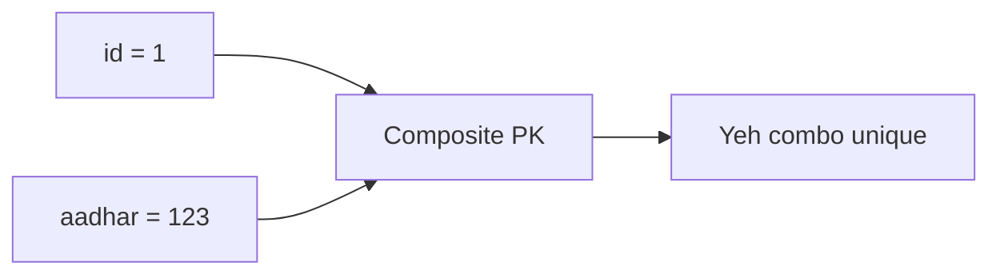

---

### Candidate Key

Jo bhi column (ya combo) row ko **uniquely identify** kar sake, aur PK ban *sakta* ho — woh **Candidate Key** hai.

Ek table me kai candidate keys ho sakti hain. Unme se **ek** ko PK banate hain.

Example: `id`, `email`, `phone` — teeno unique → teeno candidate.

---

### Alternate Key

Candidate keys me se **jo PK nahi bani**, woh **Alternate Key** hain.

```text
Candidate Keys :  id, email, phone
        ↓ ek select
Primary Key    :  id
Alternate Keys :  email, phone
```

Election se: kai candidates khade → Candidate Keys.  
Ek jeet gaya → Primary Key.  
Baaki → Alternate Keys.

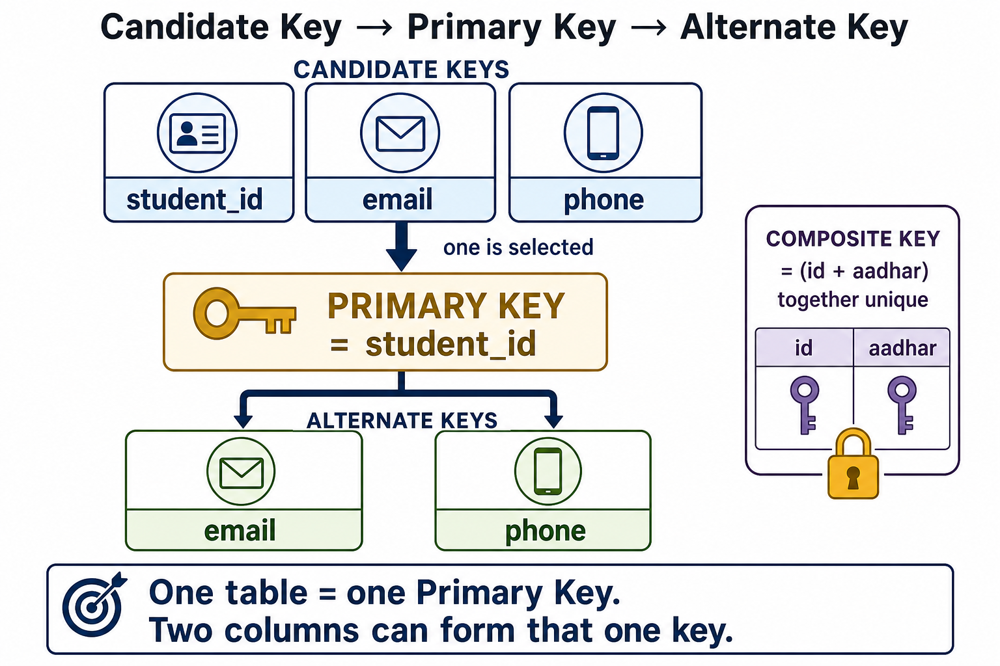

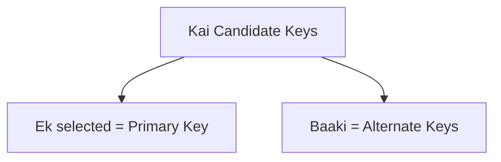

---

### Interview: do Primary Key?

| Sawal | Jawab |
|--------|--------|
| Kya ek table me **do Primary Key** bana sakte ho? | **Nahi.** Ek table = **ek** PK constraint. |
| Kya **do columns** par Primary Key laga sakte ho? | **Haan.** Wahi Composite Key. Ek key, do columns. |

```sql
-- ERROR: do baar PRIMARY KEY likha
CREATE TABLE Emp5
(
    id     INT PRIMARY KEY IDENTITY,
    name   VARCHAR(50),
    aadhar BIGINT PRIMARY KEY,
    age    INT
);

-- OK: ek composite PK
CREATE TABLE Emp6
(
    id     INT IDENTITY,
    name   VARCHAR(50),
    aadhar BIGINT,
    age    INT,
    PRIMARY KEY (id, aadhar)
);
```

---

### Sab 6 constraints ek table me — `candidates`

```sql
CREATE TABLE candidates
(
    id      INT PRIMARY KEY IDENTITY,          -- 1 PK
    name    VARCHAR(50) NOT NULL,              -- 4 NOT NULL
    aadhar  BIGINT UNIQUE NOT NULL,            -- 2 UNIQUE + NOT NULL
    pancard VARCHAR(50) UNIQUE NOT NULL,       -- 2 UNIQUE (doosri)
    salary  INT CHECK (salary >= 10000),       -- 6 CHECK
    age     INT DEFAULT 18,                    -- 5 DEFAULT
    country INT FOREIGN KEY REFERENCES tblcountry(cid)  -- 3 FK
);
```

Yahan **candidate keys:** `id`, `aadhar`, `pancard`.  
**Primary:** `id`. **Alternate:** `aadhar`, `pancard`.

```sql
INSERT INTO candidates (name, aadhar, pancard, salary, age, country) VALUES
('Rahul Kumar',  123456789012, 'ABCDE1234F', 25000, 22, 1),
('Amit Sharma',  234567890123, 'BCDEF2345G', 30000, 25, 2),
('Priya Singh',  345678901234, 'CDEFG3456H', 28000, 24, 3),
('Neha Verma',   456789012345, 'DEFGH4567J', 35000, 27, 4),
('Rohit Gupta',  567890123456, 'EFGHI5678K', 22000, 21, 1);

-- age nahi di → DEFAULT 18
INSERT INTO candidates (name, aadhar, pancard, salary, country)
VALUES ('Karan Malhotra', 901234567890, 'IJKLM9012P', 20000, 1);

-- salary nahi di → NULL (NOT NULL nahi hai)
INSERT INTO candidates (name, aadhar, pancard, country)
VALUES ('Pooja Sharma', 912345678901, 'JKLMN0123Q', 2);

-- ERROR examples:
-- INSERT ... salary = 5000     -- CHECK fail
-- INSERT ... name = NULL       -- NOT NULL fail
-- INSERT ... country = 99      -- FK fail
```

---

## 19. SP RETURN vs OUTPUT

Function `RETURNS` kisi bhi type ka value de sakta hai.  
**Stored procedure ka `RETURN` sirf INT** hota hai.

```sql
-- OK: INT return
CREATE PROCEDURE sp3 @uid INT
AS
BEGIN
    DECLARE @a INT;
    SELECT @a = salary FROM tblusers WHERE uid = @uid;
    RETURN @a;
END;

DECLARE @x INT;
EXEC @x = sp3 7;
PRINT @x;
```

```sql
-- ERROR: RETURN VARCHAR nahi ho sakta
CREATE PROCEDURE sp4 @uid INT
AS
BEGIN
    DECLARE @a VARCHAR(50);
    SELECT @a = name FROM tblusers WHERE uid = @uid;
    RETURN @a;   -- fail
END;
```

Text / kai values ke liye **OUTPUT** (ya `OUT`) use karo:

```sql
CREATE PROC sp7
    @uid INT,
    @m   VARCHAR(50) OUT,
    @n   INT OUT
AS
BEGIN
    SELECT @m = name, @n = salary FROM tblusers WHERE uid = @uid;
END;

DECLARE @x VARCHAR(50), @y INT;
EXEC sp7 7, @x OUT, @y OUT;
PRINT @x;
PRINT @y;
```

Class style functions: `fn1` (age), `fn2` (grade), `fn3` (gender 1/2/3 → text), `fn4` (annual).  
`fn3` tabhi chalega jab `gender` column **INT** ho. Table me `'male'` text hai to `dbo.fn3(gender)` error dega.

---

## Roz ka cheat-sheet

```sql
-- Dekhna
SELECT * FROM tblusers WHERE country = 1;

-- Jodna
SELECT U.name, C.cname
FROM tblusers U JOIN tblcountry C ON U.country = C.cid;

-- Badalna
UPDATE tblusers SET salary = 20000 WHERE name = 'alok';

-- Hatana (soch ke!)
DELETE FROM tblusers WHERE name = 'test';

-- Ginti
SELECT COUNT(*) FROM tblusers;
SELECT gender, COUNT(*) FROM tblusers GROUP BY gender;
```

---

## Practice order

1. Tables banao, `SELECT *` se dekho.  
2. India ke users nikaalo (`WHERE country = 1`).  
3. JOIN se naam + country naam dikhao.  
4. Brazil add karke `RIGHT JOIN` me khali user dekho.  
5. `CASE` se gender swap karo, phir wapas.  
6. Age function banao.  
7. View banao jisme salary na ho.  
8. Insert SP chalao.  
9. Trigger ke baad audit table check karo.  
10. `GROUP BY gender` se ginti nikaalo.  
11. Average se zyada salary wale subquery se dhoondho.  
12. Emp1 / Emp2 / Emp3 se PK vs Unique test karo.  
13. `candidates` me DEFAULT age aur CHECK salary try karo.  
14. Emp5 (do PK) error vs Emp6 (composite PK) OK.  
15. `RETURN` se VARCHAR nikaalne ki error dekho, phir `OUTPUT` use karo.

SQL copy-paste ke liye **`sql.text`** kholo.
